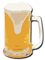

# ale*funcs*
####A bunch of tools *easy to drink* ;)

*cheers!*

**alefuncs.py** is a collection of functions and classes I have initially wrote during my PhD and it ended up being my personal collection of useful functions and classes.

Initially written in Python 2.x *(for [PyPy](https://pypy.org/) and [NumPyPy](https://bitbucket.org/pypy/numpy) compatibility)*, I have decided to modernize it after Python 3.6 was released. So, consider this module to be **compatible with Python 3.6 and above**.

This collection is meant to be used by **"copy/paste"** *(mostly because the nature and the scope of its tools are very sparse)*. Altough you can use `from alefuncs import something`, `from alefuncs import *`, and `import alefuncs as ale`, without problems, mind that I have included the imports in the function definition for clarity and easy to use.

~~~python
def func():
    import something
    ...
    return
~~~

So, if you need to call a function over and over, then consider to move the imports at the beginning of your script.

  

